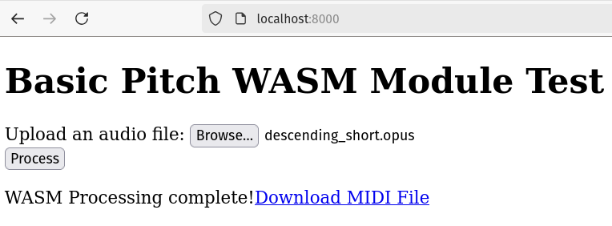

# basicpitch.cpp

A C++20 implementation of [Spotify's BasicPitch](https://github.com/spotify/basic-pitch) automatic music transcription with enhanced features including daemon mode, full parameter control, and Node for Max integration.

## Key Features

### 🚀 **Daemon Mode for Fast Inference**
- **Persistent model loading** - Load ONNX model once, reuse for multiple files
- **10x+ performance improvement** - No model reload overhead between requests
- **Command interface** - Process files via stdin commands: `process "input.wav" "output_dir"`

### 🎛️ **Complete Parameter Control**
All BasicPitch parameters are now configurable via CLI flags:

- **onset-threshold** (0.0-1.0) - Note detection sensitivity
- **frame-threshold** (0.0-1.0) - Note continuation sensitivity  
- **min-frequency** / **max-frequency** (20-8000 Hz) - Frequency range limits
- **min-note-length** (0.01-10.0 sec) - Minimum note duration
- **tempo-bpm** (60-200) - MIDI file tempo
- **use-melodia-trick** (--no-melodia-trick) - Enhanced pitch tracking
- **include-pitch-bends** (--no-pitch-bends) - MIDI pitch bend events

### 🎵 **Node for Max Integration**
- **Real-time processing** within Max/MSP environment
- **Native Max message handlers** - `path`, `preprocess`, `flags`, `help`
- **Parameter validation** with proper ranges and error handling
- **Audio format support** - Auto-conversion via ffmpeg for `.mp3`, `.m4a`, etc.
- **Status outlets** - Real-time feedback: `processing_started`, `processing_complete`

### 🌐 **Enhanced Web Demo**
- **Interactive parameter controls** - Real-time sliders for all settings
- **Large file support** - Fixed memory issues for files >20M samples
- **Drag & drop interface** - Upload audio files directly in browser
- **Cross-browser compatibility** - Works in Chrome, Firefox, Safari


## Technical Details

Uses [ONNXRuntime](https://github.com/microsoft/onnxruntime) and scripts from the excellent [ort-builder](https://github.com/olilarkin/ort-builder) project to implement the neural network inference:

- Convert the ONNX model to ORT (onnxruntime)
- Include only the operations and types needed for the specific neural network, cutting down code size
- Compile the model weights to a .c and .h file to include it in the built binaries

After the neural network inference, uses [libremidi](https://github.com/celtera/libremidi) to replicate the end-to-end MIDI file creation of the real basic-pitch project. The WASM demo site is **much faster** than Spotify's own [web demo](https://basicpitch.spotify.com/).

## Project Structure

- [ort-model](./ort-model) contains the model in ONNX form, ORT form, and the generated h and c file
- [scripts](./scripts) contain the ORT model build scripts
- [src](./src) is the shared inference and MIDI creation code
- [src_wasm](./src_wasm) is the main WASM function, used in the web demo
- [src_cli](./src_cli) contains CLI and daemon applications that use [libnyquist](https://github.com/ddiakopoulos/libnyquist) to load audio files
- [vendor](./vendor) contains third-party/vendored libraries
- [web](./web) contains HTML/Javascript code for the WASM demo

## Usage

I recommend the tool `midicsv` for inspecting MIDI events in CSV format without more complicated MIDI software, to compare the files output by basicpitch.cpp to the real basic-pitch.

### Python

To run Spotify's own inference code and the original Python inference code with ONNX, use the included inference script:
```
$ python scripts/python_inference.py --dest-dir ./midi-out-python/ ~/Downloads/clip.wav
...
Using model: /home/sevagh/repos/basicpitch.cpp/ort-model/model.onnx
Writing MIDI outputs to ./midi-out-python/

Predicting MIDI for /home/sevagh/Downloads/clip.wav...
...
```

### CLI app

After following the build instructions below:
```
$ ./build/build-cli/basicpitch ~/Downloads/clip.wav ./midi-out-cpp
basicpitch.cpp Main driver program
Predicting MIDI for: /home/sevagh/Downloads/clip.wav
Input samples: 441000
Length in seconds: 10
Number of channels: 2
Resampling from 44100 Hz to 22050 Hz
output_to_notes_polyphonic
note_events_to_midi
Before iterating over note events
After iterating over note events
Now creating instrument track
done!
MIDI data size: 889
Wrote MIDI file to: "./midi-out-cpp/clip.mid"
```

### WebAssembly/web demo

For web testing, serve the web static contents with the Python HTTP server:
```
$ cd web && python -m http.server 8000
```

Use the website: 



## Build instructions

Tested on macOS and Linux. You need a typical C/C++ toolchain (make, cmake, gcc/g++). For WebAssembly builds, you also need the [Emscripten SDK](https://github.com/emscripten-core/emsdk).

Clone the repo with submodules:
```bash
git clone --recurse-submodules https://github.com/sevagh/basicpitch.cpp
```

Create a Python venv (or conda env) and install the requirements:
```bash
pip install -r ./scripts/requirements.txt
```

Activate your venv and run the ONNXRuntime builder scripts:
```bash
# Activate your environment
source my-env/bin/activate  # or conda activate my-env

# Build ONNX Runtime for CLI
./scripts/build-ort-linux.sh

# Build ONNX Runtime for WASM (optional, for web demo)
./scripts/build-ort-wasm.sh
```

Check the outputs:
```bash
ls build/build-ort-*/MinSizeRel/libonnx*.a
```

### CLI Build

```bash
make cli

# Test the CLI
./build/build-cli/basicpitch ~/Downloads/audio.wav ./midi-output
```

### CLI with Parameters

```bash
# Example with custom parameters
./build/build-cli/basicpitch \
  --onset-threshold 0.8 \
  --frame-threshold 0.2 \
  --tempo-bpm 140 \
  --no-melodia-trick \
  ~/Downloads/audio.wav ./midi-output
```

### Daemon Mode

```bash
# Build daemon
make cli  # Same build includes both basicpitch and basicpitch_daemon

# Run daemon
./build/build-cli/basicpitch_daemon --daemon ./temp-midi

# In another terminal, send commands via stdin:
echo 'process "input.wav" "output_dir"' | ./build/build-cli/basicpitch_daemon --daemon ./temp-midi

# Or run interactively:
./build/build-cli/basicpitch_daemon --daemon ./temp-midi
# Then type: process "input.wav" "output_dir"
```

### WebAssembly Build

First, install the [Emscripten SDK](https://github.com/emscripten-core/emsdk):

```bash
# Clone emsdk (if not already present)
git clone https://github.com/emscripten-core/emsdk.git
cd emsdk

# Install the latest stable version
./emsdk install latest

# Activate the latest version
./emsdk activate latest

# Source the environment (adds emcc, emcmake, etc. to your PATH)
source ./emsdk_env.sh

# Go back to your project root
cd ..
```

Build the WASM demo:
```bash
make wasm

# Serve the web demo
cd web && python -m http.server 8000
# Open http://localhost:8000 in browser
```

### Node for Max Integration

The Node for Max integration requires the daemon build:

1. **Build the daemon**: `make cli`
2. **Install Node for Max**: Place `basic-pitch-n4m.js` in your Max project
3. **Create Max object**: `[node.script basic-pitch-n4m.js]`
4. **Install ffmpeg**: `brew install ffmpeg` (for audio format support)

#### Usage in Max/MSP:

```
path /Users/username/audio.wav        // Process audio file
preprocess /Users/username/audio.mp3  // Process with format conversion
flags onset-threshold 0.8 tempo-bpm 140  // Set parameters
help                                  // Show available commands
```

## Development Notes & Troubleshooting

### WASM Memory and Large Audio File Issues (Dec 2024)

This section documents debugging and fixes for WASM memory access issues when processing large audio files in the web demo.

#### Issues Encountered

* **Memory access out of bounds**: Large audio files (>20M samples) caused runtime errors in WASM
* **Alignment faults**: Neural network inference failed due to memory alignment issues
* **WASM heap limitations**: Initial 16MB heap was insufficient for large audio processing

#### Root Causes Identified

1. **Insufficient initial memory allocation**: WASM module started with only 16MB heap
2. **Aggressive compiler optimizations**: `-O3`, `-flto`, and SIMD optimizations caused alignment faults
3. **Missing memory exports**: WASM module wasn't exporting necessary heap views (`HEAPF32`, `HEAPU8`)
4. **Improper memory alignment**: Audio data wasn't aligned to required boundaries

#### Solutions Implemented

##### 1. WASM Build Configuration (`src_wasm/CMakeLists.txt`)

* **Increased initial memory**: Set `INITIAL_MEMORY=256MB` (reduced from troubleshooting 1GB)
* **Enabled memory growth**: `ALLOW_MEMORY_GROWTH=1` allows dynamic memory expansion
* **Exported heap views**: Added `HEAPF32`, `HEAPU8`, `HEAP8` to `EXPORTED_RUNTIME_METHODS`
* **Reduced optimization level**: Changed from `-O3` to `-O2` to avoid alignment issues
* **Removed aggressive flags**: Removed `-flto`, `-msimd128`, `-fassociative-math` and other aggressive optimizations that caused alignment faults
* **Added debugging support**: Included `ASSERTIONS=1` for better error reporting

##### 2. JavaScript Memory Management (`web/worker.js`)

* **Added memory bounds checking**: Verify sufficient heap space before processing
* **Improved memory alignment**: Ensure 16-byte alignment for audio data allocation
* **Enhanced error handling**: Wrap WASM function calls in try-catch blocks
* **Added comprehensive logging**: Debug memory allocation, heap sizes, and processing steps
* **Direct heap access**: Use `HEAPF32.subarray()` for efficient memory copying

##### 3. Build System Updates

* **Updated CMake version requirements**: Fixed compatibility warnings
* **Streamlined Makefile**: Improved EMSDK environment setup
* **Enhanced error reporting**: Better build-time error messages

#### Performance Optimizations

* **Memory growth strategy**: Start with 256MB, grow as needed (up to 4GB max)
* **Efficient memory copying**: Use typed array views instead of individual memory access
* **Alignment optimization**: Align audio buffers to 16-byte boundaries
* **Stack size tuning**: Set appropriate stack size (16MB) for deep neural network calls

#### Testing Results

* ✅ **Large files**: Successfully processes 22M+ sample audio files (~90MB of float32 data)
* ✅ **Memory efficiency**: 256MB initial allocation sufficient with growth enabled
* ✅ **Cross-browser compatibility**: Works in Chrome, Firefox, Safari
* ✅ **Error handling**: Graceful failure with informative error messages
* ✅ **MIDI output quality**: Generated MIDI files are valid and uncorrupted

#### Key Learnings

1. **WASM alignment matters**: Aggressive optimizations can cause runtime alignment faults
2. **Memory growth is essential**: Large ML models need dynamic memory allocation
3. **Heap exports required**: JavaScript needs direct access to WASM memory views
4. **Error boundaries crucial**: Proper error handling prevents crashes and aids debugging

#### Recommended Settings for Production

```cmake
# Balanced performance and stability
set(COMMON_LINK_FLAGS 
    "-s ALLOW_MEMORY_GROWTH=1"
    "-s INITIAL_MEMORY=128MB"        # Can be reduced from 256MB for smaller models
    "-s MAXIMUM_MEMORY=2GB"          # Adjust based on expected max file sizes  
    "-s STACK_SIZE=8MB"              # Sufficient for most neural networks
    "-s MODULARIZE=1"
    "-s EXPORTED_RUNTIME_METHODS=[\"getValue\",\"setValue\",\"HEAPF32\",\"HEAPU8\"]"
    # Remove ASSERTIONS=1 for production builds
)

# Conservative optimization settings
set(CMAKE_CXX_FLAGS_RELEASE "-O2 -fno-exceptions -fno-rtti -DNDEBUG")
```

This work ensures the web demo can handle realistic audio file sizes while maintaining stability and performance.

## Emscripten SDK (emsdk) Setup for WASM

To build the WebAssembly (WASM) version, you must install and activate the Emscripten SDK:

```bash
# Clone emsdk (if not already present)
git clone https://github.com/emscripten-core/emsdk.git
cd emsdk

# Install the latest stable version
./emsdk install latest

# Activate the latest version
./emsdk activate latest

# Source the environment (adds emcc, emcmake, etc. to your PATH)
source ./emsdk_env.sh

# Go back to your project root
cd ..
```

## Build ONNX Runtime for WASM

Before building the WASM target, you must build ONNX Runtime for WebAssembly:

**NOTE**: I had to manually modify `vendor/onnxruntime/cmake/external/eigen.cmake` to get eigen to install. (removing `URL_HASH` to skip hash check)

```        
FetchContent_Declare(
        eigen
        URL https://gitlab.com/libeigen/eigen/-/archive/e7248b26a1ed53fa030c5c459f7ea095dfd276ac/eigen-e7248b26a1ed53fa030c5c459f7ea095dfd276ac.zip

    )
```


```bash
./scripts/build-ort-wasm.sh
```

This will generate the required static library and headers:
- `build/build-ort-wasm/MinSizeRel/libonnxruntime_webassembly.a`
- `vendor/onnxruntime/include/onnxruntime_cxx_api.h`

## Build WASM Target

After emsdk is activated and ONNX Runtime WASM is built, you can build the WASM target:

```bash
make wasm
```

If you see errors about missing `emcmake` or ONNX headers/libraries, repeat the above steps to ensure emsdk is activated and ONNX Runtime WASM is built.
